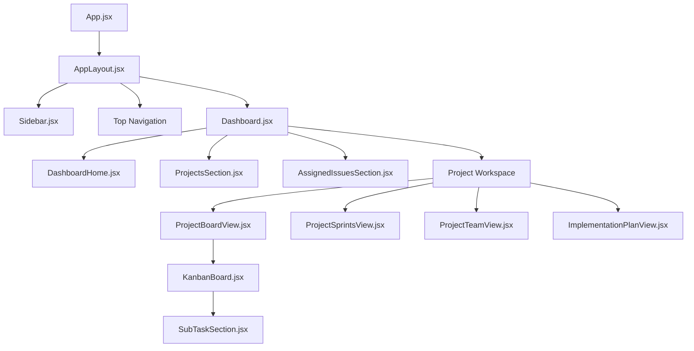

# CoreOps - Professional Project Management Suite

CoreOps is a high-velocity project management platform built on the **PERN stack** (PostgreSQL, Express, React, Node.js). Inspired by the Atlassian Design System, it provides a powerful yet minimal interface for teams to track projects, manage complex issue lifecycles, and plan roadmaps with precision.

---

## 🚀 Key Functionality

### 🔐 Authentication & Identity
- **Role-Based Access Control (RBAC)**: Supports roles for `ADMIN`, `PROJECT_MANAGER`, `DEVELOPER`, and `USER` with granular permission gating.
- **Secure Sessions**: JWT-based authentication stored in secure cookies.
- **Dynamic Onboarding**: Multi-step registration for different team roles.

### 📁 Project Management
- **Workspaces**: Create and manage multiple projects with unique **Project Keys** (e.g., `CORE`, `MKTG`).
- **Ownership**: Explicit project ownership and member management (Add/Remove members).
- **Project Summaries**: High-level stats for active tasks, team size, and overall progress.

### 📋 Issue & Task Tracking
- **Interactive Kanban Board**: Drag-and-drop issues between status columns (`To Do`, `In Progress`, `Done`).
- **Granular Subtasks**: Break down complex issues into actionable subtasks with interactive progress bars.
- **Priority Gating**: Color-coded priority indicators (High, Medium, Low) and advanced filtering.
- **Issue Backlog**: Manage unassigned issues and preparation for sprint inclusion.

### 🏃 Sprint Lifecycle
- **Sprint Planning**: Create sprints with specific timelines and goals.
- **Focus Mode**: View and manage tasks specifically within the active sprint context.
- **Sprint Insights**: Track velocity and completion rates.

### 🗺️ Implementation Roadmap
- **Stepped Progress**: A specialized view for tracing the exact execution steps of a project.
- **Hierarchy**: Links high-level issues to granular subtask completion for precise status reporting.

---

## 🎨 Client-Side Design

### Design System (ADS)
The application utilizes a custom design system inspired by **Atlassian Design System (ADS)**, implemented using **Tailwind CSS v4** tokens:
- **Colors**: Standardized palette (`ads-primary`, `ads-surface`, `ads-text`, `ads-success`, etc.).
- **Typography**: Optimized hierarchy using the **Inter** font family.
- **Components**: Reusable UI primitives located in `src/components/ui/`.

### Component Hierarchy


---

## 🔌 API & Component Mapping

The frontend communicates with the backend via a centralized `apiRequest` (Axios) utility. Below is the comprehensive mapping of core modules:

### 👤 Identity & Users
| API Endpoint | Method | Description | Component |
| :--- | :--- | :--- | :--- |
| `/api/users/register` | `POST` | Multi-step user onboarding | `Register.jsx` |
| `/api/users/login` | `POST` | Secure session initialization | `Login.jsx` |
| `/api/users/logout` | `POST` | Session termination | `Sidebar.jsx` |
| `/api/users` | `GET` | Fetch current session user | `App.jsx` |
| `/api/users/profile` | `PUT` | Update profile (Name/Password) | `ProfileSettings.jsx` |
| `/api/users/developers`| `GET` | List available developers | `IssueModal.jsx` |

### 📁 Projects & Workspaces
| API Endpoint | Method | Description | Component |
| :--- | :--- | :--- | :--- |
| `/api/projects` | `GET` | List all accessible projects | `ProjectsSection.jsx` |
| `/api/projects` | `POST` | Create new project workspace | `ProjectModal.jsx` |
| `/api/projects/:id` | `GET` | Fetch project details & issues | `ProjectBoardView.jsx` |
| `/api/projects/:id` | `PUT` | Edit project metadata | `ProjectModal.jsx` |
| `/api/projects/:id` | `DELETE`| Permanent project removal | `ProjectsSection.jsx` |
| `/members/add` | `PUT` | Add member to project | `ProjectTeamView.jsx` |
| `/members/remove` | `PUT` | Remove member from project | `ProjectTeamView.jsx` |

### 📋 Issues & Tasks
| API Endpoint | Method | Description | Component |
| :--- | :--- | :--- | :--- |
| `/api/issues` | `GET` | Fetch global assigned issues | `AssignedIssuesSection.jsx`|
| `/api/issues` | `POST` | Create new issue/task | `IssueModal.jsx` |
| `/api/issues/:id` | `GET` | Fetch single issue details | `IssueModal.jsx` |
| `/api/issues/:id` | `PUT` | Update issue (Status/Assignee) | `KanbanBoard.jsx`, `IssueModal`|
| `/api/issues/:id` | `DELETE`| Permanent issue removal | `IssueModal.jsx` |

### 🏃 Sprints & Roadmap
| API Endpoint | Method | Description | Component |
| :--- | :--- | :--- | :--- |
| `/api/sprints` | `POST` | Initialize new sprint | `SprintModal.jsx` |
| `/api/sprints/:id` | `PUT` | Transition sprint status | `ProjectSprintsView.jsx`|
| `/api/sprints/:id` | `DELETE`| Remove planned/old sprint | `ProjectSprintsView.jsx`|
| `/insights/:projectId`| `GET` | Velocity & completion metrics | `AnalyticsDashboard.jsx`|

### 💬 Discussion & SubTasks
| API Endpoint | Method | Description | Component |
| :--- | :--- | :--- | :--- |
| `/api/subtasks/:issueId`| `POST`| Create granular subtask | `SubTaskSection.jsx` |
| `/:id/toggle` | `PATCH`| Toggle subtask completion | `ImplementationPlanView.jsx`|
| `/comments/issue/:id` | `GET` | Fetch issue discussion thread | `CommentSection.jsx` |
| `/api/comments` | `POST` | Add comment to discussion | `CommentSection.jsx` |

### 🔔 Notifications
| API Endpoint | Method | Description | Component |
| :--- | :--- | :--- | :--- |
| `/api/notifications` | `GET` | Fetch user alerts & history | `NotificationBell.jsx` |
| `/:id/read` | `PATCH`| Mark specific alert as read | `NotificationBell.jsx` |
| `/read-all` | `PATCH`| Dismiss all active alerts | `NotificationBell.jsx` |

---

## 🛠️ Technology Stack

### Frontend
- **Framework**: React 19 (Vite)
- **State Management**: Redux Toolkit (Auth/Identity), React Hooks (Component state)
- **Navigation**: React Router v7
- **Styling**: Tailwind CSS v4, Lucide React (Icons)
- **Interactions**: `@hello-pangea/dnd` (Drag & Drop)

### Backend
- **Server**: Node.js & Express.js
- **Database**: PostgreSQL
- **ORM**: Prisma
- **Authentication**: JWT, Bcrypt.js
- **Middleware**: Custom Auth Interceptors, Role Authorizers

---

## 📦 Getting Started

1. **Clone the repository**
2. **Environment Setup**:
   - Create `backend/.env` with `DATABASE_URL`, `JWT_SECRET`, and `PORT`.
   - Create `frontend/.env` with `VITE_API_ENDPOINT`.
3. **Database Migration**:
   ```bash
   cd backend
   npx prisma migrate dev
   ```
4. **Run Locally**:
   - Backend: `npm run dev` in `backend/`
   - Frontend: `npm run dev` in `frontend/`
