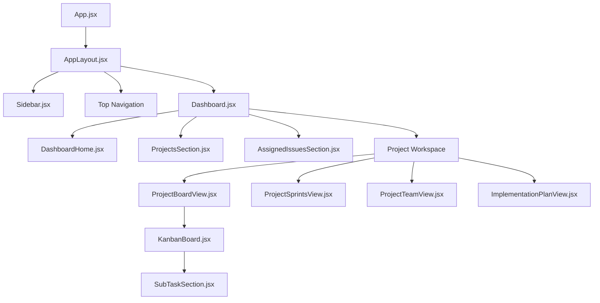

# CoreOps - Professional Project Management Suite

CoreOps is a high-velocity project management platform built on the **PERN stack** (PostgreSQL, Express, React, Node.js). Inspired by the Atlassian Design System, it provides a powerful yet minimal interface for teams to track projects, manage complex issue lifecycles, and plan roadmaps with precision.

---

## 🚀 Key Functionality

### 🔐 Authentication & Identity
- **Role-Based Access Control (RBAC)**: Supports roles for `ADMIN`, `PROJECT_MANAGER`, `DEVELOPER`, and `USER` with granular permission gating.
- **Secure Sessions**: JWT-based authentication stored in secure cookies.
- **Dynamic Onboarding**: Multi-step registration for different team roles.

### 📁 Project Management
- **Workspaces**: Create and manage multiple projects with unique **Project Keys** (e.g., `CORE`, `MKTG`).
- **Ownership**: Explicit project ownership and member management (Add/Remove members).
- **Project Summaries**: High-level stats for active tasks, team size, and overall progress.

### 📋 Issue & Task Tracking
- **Interactive Kanban Board**: Drag-and-drop issues between status columns (`To Do`, `In Progress`, `Done`).
- **Granular Subtasks**: Break down complex issues into actionable subtasks with interactive progress bars.
- **Priority Gating**: Color-coded priority indicators (High, Medium, Low) and advanced filtering.
- **Issue Backlog**: Manage unassigned issues and preparation for sprint inclusion.

### 🏃 Sprint Lifecycle
- **Sprint Planning**: Create sprints with specific timelines and goals.
- **Focus Mode**: View and manage tasks specifically within the active sprint context.
- **Sprint Insights**: Track velocity and completion rates.

### 🗺️ Implementation Roadmap
- **Stepped Progress**: A specialized view for tracing the exact execution steps of a project.
- **Hierarchy**: Links high-level issues to granular subtask completion for precise status reporting.

---

## 🎨 Client-Side Design

### Design System (ADS)
The application utilizes a custom design system inspired by **Atlassian Design System (ADS)**, implemented using **Tailwind CSS v4** tokens:
- **Colors**: Standardized palette (`ads-primary`, `ads-surface`, `ads-text`, `ads-success`, etc.).
- **Typography**: Optimized hierarchy using the **Inter** font family.
- **Components**: Reusable UI primitives located in `src/components/ui/`.

### Component Hierarchy


---

## 🔌 API & Component Mapping

The frontend communicates with the backend via a centralized `apiRequest` (Axios) utility. Below is the mapping of core components to their corresponding API interactions:

| Component | Responsibility | Primary API Calls |
| :--- | :--- | :--- |
| **Login.jsx** | Handing user authentication | `POST /users/login` |
| **Register.jsx** | Managing user onboarding | `POST /users/register` |
| **Dashboard.jsx** | Global data coordination | `GET /projects`, `GET /issues` |
| **ProjectsSection.jsx** | Project CRUD & Dashboard view | `GET /projects`, `POST /projects`, `DELETE /projects/:id` |
| **ProjectBoardView.jsx** | Main Workspace logic | `GET /projects/:id`, `POST /issues`, `PUT /issues/:id` |
| **KanbanBoard.jsx** | Drag & Drop interaction | `PUT /issues/:id` (Status update) |
| **SubTaskSection.jsx** | Granular task management | `GET /subtasks/:issueId`, `POST /subtasks/:issueId`, `PATCH /subtasks/:id/toggle` |
| **ProjectSprintsView.jsx** | Sprint planning and tracking | `POST /sprints`, `PUT /sprints/:id`, `DELETE /sprints/:id` |
| **ProjectTeamView.jsx** | Project membership management | `PUT /projects/members/add`, `PUT /projects/members/remove` |
| **ImplementationPlanView.jsx**| High-level roadmap tracking | `GET /projects/:id` (Hydrated issues & subtasks) |

---

## 🛠️ Technology Stack

### Frontend
- **Framework**: React 19 (Vite)
- **State Management**: Redux Toolkit (Auth/Identity), React Hooks (Component state)
- **Navigation**: React Router v7
- **Styling**: Tailwind CSS v4, Lucide React (Icons)
- **Interactions**: `@hello-pangea/dnd` (Drag & Drop)

### Backend
- **Server**: Node.js & Express.js
- **Database**: PostgreSQL
- **ORM**: Prisma
- **Authentication**: JWT, Bcrypt.js
- **Middleware**: Custom Auth Interceptors, Role Authorizers

---

## 📦 Getting Started

1. **Clone the repository**
2. **Environment Setup**:
   - Create `backend/.env` with `DATABASE_URL`, `JWT_SECRET`, and `PORT`.
   - Create `frontend/.env` with `VITE_API_ENDPOINT`.
3. **Database Migration**:
   ```bash
   cd backend
   npx prisma migrate dev
   ```
4. **Run Locally**:
   - Backend: `npm run dev` in `backend/`
   - Frontend: `npm run dev` in `frontend/`
